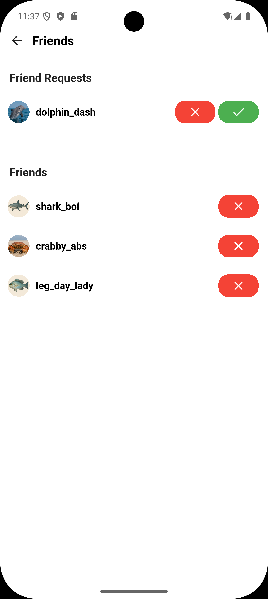

Friends Page
============

Source File: ``flutter/lib/frontend/modal/show_friends_modal.dart``

Overview
--------
The FriendsPage is a Flutter widget that displays and manages the user's social connection, including:

- Current friends list
- Pending friend requests
- Friend management actions (accept/decline/remove)

UI Structure
------------
1. **Header Section**
   - Back button
   - "Friends" title

2. **Requests Section**
   - Section header
   - List of ``FriendRequestWidget`` instances

3. **Friends Section**
   - Section header
   - List of ``FriendWidget`` instances

Components
----------

FriendsPage
^^^^^^^^^^^
The main container widget that displays both friend requests and friends list

Properties
~~~~~~~~~~
.. list-table::
   :widths: 20 80
   :header-rows: 1

   * - Property
     - Description
   * - ``userID`` (int)
     - The ID of the currently logged in user, provided by ``userProvider.dart``

State Management
~~~~~~~~~~~~~~~
- Uses Riverpod's ConsumerStatefulWidget for state management
- Maintains two futures:
   .. list-table::
     :widths: 30 70
     
     * - Future
       - Description
     * - ``friends``
       - List of current friends (``List<Map<String, dynamic>>``)
     * - ``friendRequests``
       - List of pending requests (``List<Map<String, dynamic>>``)

Key Features
~~~~~~~~~~~~
- Two-section layout (requests above, friends below)
- Dynamic data refreshing
- Loading state handling
- Error states for API failures

FriendWidget
^^^^^^^^^^^^
- Displays an individual friend in the friends list
- Displays their profile photo and username, which can be clicked to bring up their profile page as a bottom sheet modal

Properties
~~~~~~~~~~
.. list-table::
   :widths: 20 30 50
   :header-rows: 1

   * - Name
     - Type
     - Description
   * - ``friend``
     - ``Map<String, dynamic>``
     - Contains friend data with keys:
       - ``user_ID`` (int)
       - ``user_name`` (String)
       - ``user_profile_photo`` (String)
   * - ``onResponse``
     - ``VoidCallback``
     - Refresh trigger after state changes

Methods
~~~~~~~
.. method:: openProfileModal(BuildContext context, int userID)
   :noindex:
   
   Displays the user profile in a bottom sheet modal

FriendRequestWidget
^^^^^^^^^^^^^^^^^^
Displays an individual pending friend request.

Properties
~~~~~~~~~~
- friend (Map<String, dynamic>): Friend data including:
  - ``user_ID`` (int): Friend's userID
- When the user taps on 'friends' underneath their username on the profile page it will bring up a bottom sheet modal showing their friend request and friends
- 'showDialog' function is implemented to display the list of friends usernames
- Provider is used to fetch the list of friends
- View friends' profile using action button for each friend
- Accept or decline Friend requests

Image Reference
--------------
