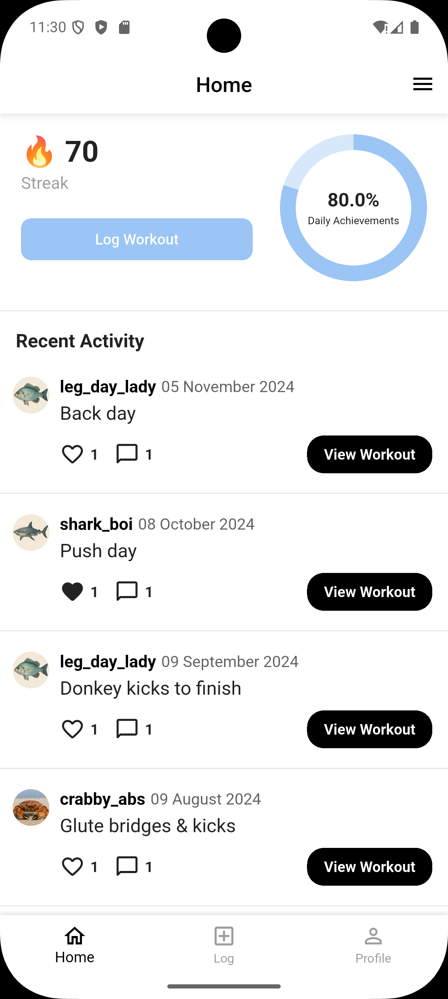

.. _home-page:

Home Page
=========

Source File:  ``flutter/lib/frontend/states/home_page.dart``

Overview
--------
The Home Page is the main page the user will enter after logging in/ signing up. 
It will display the user's fitness progress, including daily streak goals, workout logging options, and recent activity posts from other users.

Widget Hierarchy
---------------
- ``HomePage`` (ConsumerStatefulWidget)
  - ``_HomePageState`` (ConsumerState)
    - ``_buildStreakBanner()``
    - ``FriendsPosts`` (ConsumerWidget)

Components
----------

HomePage Class
^^^^^^^^^^^^^^
.. list-table::
   :widths: 30 70
   :header-rows: 1

   * - Property
     - Description
   * - key
     - Standard Flutter widget key

HomePageState Methods
^^^^^^^^^^^^^^^^^^^^
.. list-table::
   :widths: 25 75
   :header-rows: 1

   * - Method
     - Description
   * - initState()
     - Loads friends' workouts on initialization
   * - openLogWorkoutModal()
     - Shows workout logging bottom sheet
   * - _buildStreakBanner()
     - Builds the top progress display

FriendsPosts Methods
^^^^^^^^^^^^^^^^^^^
.. list-table::
   :widths: 25 75
   :header-rows: 1

   * - Method
     - Description
   * - openWorkoutModal()
     - Shows workout details
   * - openProfileModal()
     - Shows friend's profile
   * - build()
     - Renders posts list

UI Structure
-----------

Streak Banner
^^^^^^^^^^^^^
Contains:
1. Streak counter (🔥 70 - hardcoded)
2. "Log Workout" button
3. Circular progress indicator (4/5 hardcoded)

Recent Activity Section
^^^^^^^^^^^^^^^^^^^^^^
1. Section header ("Recent Activity")
2. FriendsPosts list showing:
   - Friend's profile image (clickable)
   - Username (clickable)
   - Post date
   - Workout caption
   - Like/comment buttons
   - "View Workout" button

Data Structure
-------------

Workout Post Data
^^^^^^^^^^^^^^^^
.. list-table::
   :widths: 20 30 50
   :header-rows: 1

   * - Key
     - Type
     - Description
   * - user_ID
     - int
     - Friend's user ID
   * - user_profile_photo
     - String
     - Profile image name
   * - user_name
     - String
     - Friend's username
   * - workout_date_time
     - DateTime
     - Post timestamp
   * - workout_caption
     - String
     - Workout description
   * - hasLiked
     - bool
     - Current user's like status
   * - total_likes
     - int
     - Like count
   * - total_comments
     - int
     - Comment count
   * - workout_ID
     - int
     - Unique workout ID

State Management
---------------
- Uses Riverpod's ConsumerStatefulWidget
- Watches ``postNotifier`` for friends' workouts
- Manages modal states internally

Image Assets
-----------
From ``assets/`` directory:
- [user_profile_photo].png (dynamic based on friend data)

Interactions
-----------
1. Clicking profile image/username:
   - Opens friend's profile (``ViewingProfilePage``)

2. Clicking like icon:
   - Toggles like status via ``postNotifier``

3. Clicking comment icon:
   - Opens workout details (``MyWorkoutPage``)

4. Clicking "View Workout":
   - Opens workout details (``MyWorkoutPage``)

5. Clicking "Log Workout":
   - Opens workout logging (``LogWorkoutPage``)

Image Reference
------------------
