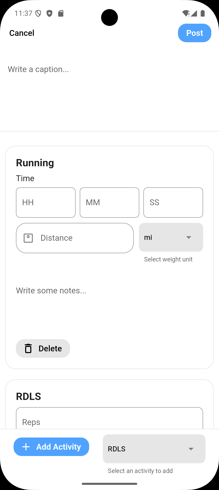

Log Workout Page
================

**File:** `flutter/lib/frontend/states/log_workout_page.dart`

This screen allows users to input workout data like title, duration, and calories burned.

Fields
------

- Workout caption
- Activities: which can have the following fields depending on the exercise
    - Duration (hours, minutes, seconds)
    - Incline
    - Distance (miles or km)
    - Weight (kg or lbs)
    - Sets
    - Reps
    - All activties have a 'notes' field

Components
------------

Widget
^^^^^^^^^^^^^^^^^^
Properties
~~~~~~~~~~~~~~~~~~~~
State Management
~~~~~~~~~~~~~~~~~~~~
Key Features
~~~~~~~~~~~~~~~~~~~~

Functionality
-------------

- Validates distance, weight and incline are all valid decimal/floating numbers in the input field
- Validates sets and reps are valid integers in the input field
- Calls `addNewWorkout()` from the backend/api.dart
- Displays confirmation message or error feedback.

How it works
-----

- Add activity types
- Include date/time picker

Image Reference
------------------
