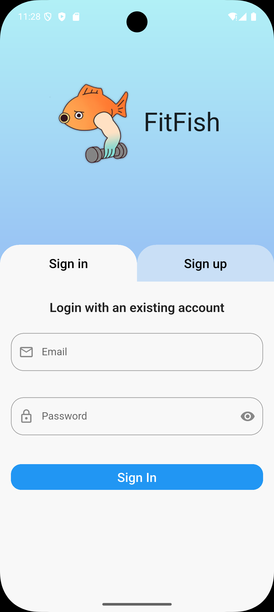
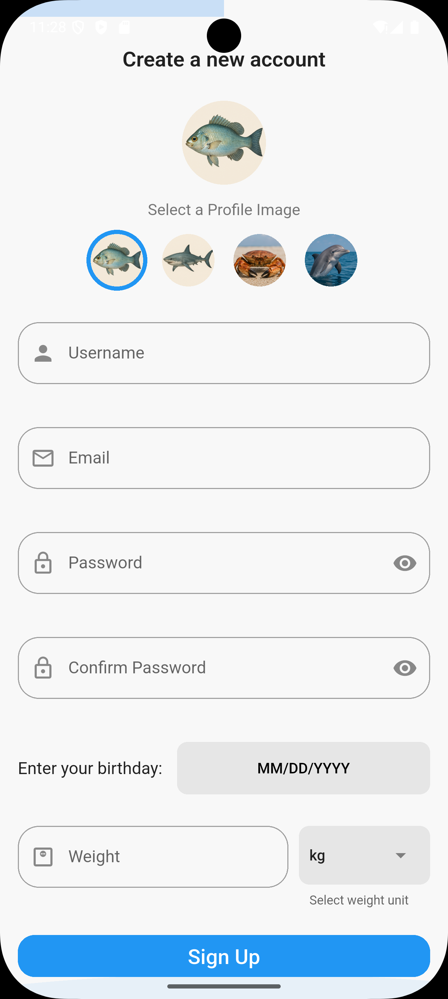

Login Screen
============

**File:** `flutter/lib/frontend/states/login_screen.dart`

Overview: 
---------
This screen is used to authenticate credentials when signing in. 
It is the main screen when you open the app and are required to either sign up or sign in.

Current Status
--------------

- Placeholder for login form
- Input fields for email and password

How it works
-----

- Connect to backend auth system
- Validate credentials using `sign_in_data.dart`

Image Reference
------------------

