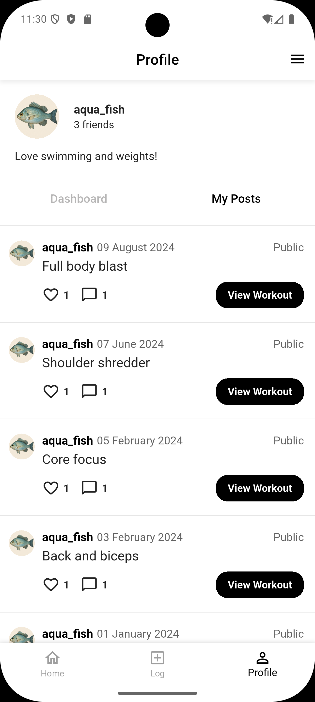

.. _profile-page:

Profile Page
============

Source File: ``profile_page.dart``

Widget Hierarchy
---------------
- ``ProfilePage`` (ConsumerStatefulWidget)
  - ``ProfilePageState`` (ConsumerState)
    - ``Dashboard`` (StatelessWidget)
    - ``MyPosts`` (ConsumerWidget)

Exact Components from File
-------------------------

ProfilePage Class
^^^^^^^^^^^^^^^^
.. list-table::
   :widths: 30 70
   :header-rows: 1

   * - Property
     - Description
   * - key
     - Standard Flutter widget key

ProfilePageState Properties
^^^^^^^^^^^^^^^^^^^^^^^^^^
.. list-table::
   :widths: 20 30 50
   :header-rows: 1

   * - Name
     - Type
     - Description
   * - dashBoardMode
     - bool
     - Toggles between dashboard/posts views (default: true)

ProfilePageState Methods
^^^^^^^^^^^^^^^^^^^^^^^
.. list-table::
   :widths: 25 75
   :header-rows: 1

   * - Method
     - Description
   * - openFriendModal()
     - Shows friend list bottom sheet
   * - build()
     - Builds profile UI

Dashboard Widget
^^^^^^^^^^^^^^^
.. list-table::
   :widths: 30 70
   :header-rows: 1

   * - Property
     - Description
   * - key
     - Standard Flutter widget key

MyPosts Widget
^^^^^^^^^^^^^
.. list-table::
   :widths: 20 30 50
   :header-rows: 1

   * - Property
     - Description
   * - workouts
     - List<Map<String,dynamic>>
     - Workout data to display
   * - key
     - Standard Flutter widget key

MyPosts Methods
^^^^^^^^^^^^^^
.. list-table::
   :widths: 25 75
   :header-rows: 1

   * - Method
     - Description
   * - openWorkoutModal()
     - Shows workout details bottom sheet
   * - build()
     - Builds posts list UI

UI Structure (From build() methods)
----------------------------------

Profile Page Structure
^^^^^^^^^^^^^^^^^^^^^
1. User profile header with:
   - Profile image
   - Username
   - Friend count (clickable)
   - Biography

2. Toggle buttons for:
   - Dashboard
   - My Posts

3. Content area showing either:
   - Dashboard (placeholder)
   - MyPosts (workout list)

MyPosts Structure
^^^^^^^^^^^^^^^^
For each workout:
1. User avatar and name
2. Post date and visibility (Public/Private)
3. Workout caption
4. Interaction buttons:
   - Like/Unlike
   - Comment
   - "View Workout" button

Data Structure
--------------

Workout Post Data
^^^^^^^^^^^^^^^^
.. list-table::
   :widths: 20 30 50
   :header-rows: 1

   * - Key
     - Type
     - Description
   * - user_profile_photo
     - String
     - Profile image asset name
   * - user_name
     - String
     - Poster's username
   * - workout_date_time
     - DateTime
     - Post timestamp
   * - workout_public
     - bool
     - Visibility status
   * - workout_caption
     - String
     - Post content
   * - hasLiked
     - bool
     - Current user's like status
   * - total_likes
     - int
     - Like count
   * - total_comments
     - int
     - Comment count
   * - workout_ID
     - int
     - Unique workout identifier

Asset References
---------------
From ``assets/`` directory:
- [user_profile_photo].png (dynamic based on user data)
- Other profile images referenced in friend modal

Modal Components
---------------
1. Friend Modal
   - Triggered by clicking friend count
   - Shows ``FriendsPage`` from ``show_friend_modal.dart``

2. Workout Modal
   - Triggered by "View Workout" button
   - Shows ``MyWorkoutPage`` from ``show_workout_modal.dart``

Image Reference
-----------------
